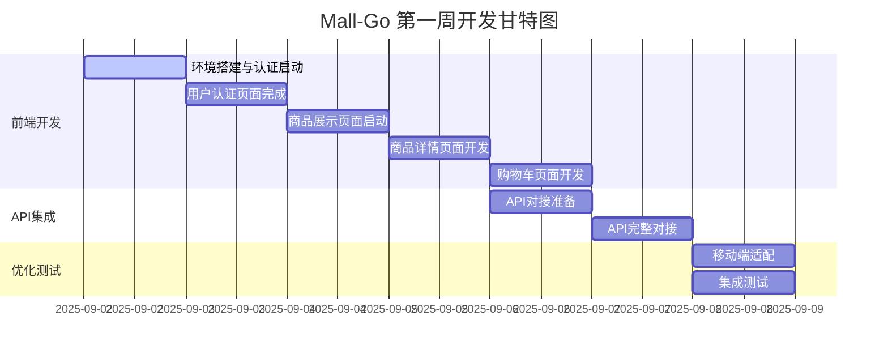

# Mall-Go 项目第一周开发计划 (2025.09.02-09.08)

**制定日期**: 2025年8月30日  
**执行周期**: 2025年9月2日 - 2025年9月8日  
**计划制定者**: Claude 4.0 Sonnet  
**基于文档**: 《2025-08-30 COMPREHENSIVE_TODO_ANALYSIS.md》  

---

## 🎯 **周计划概览**

### **核心目标**
基于综合任务分析报告，本周重点完成🔴高优先级任务，确保用户可以完成完整的购物流程测试。

### **工作量分配**
- **总预估工时**: 84小时 (7天 × 12小时)
- **前端核心页面开发**: 40小时 (47.6%)
- **API接口完整对接**: 24小时 (28.6%)
- **移动端响应式适配**: 16小时 (19.0%)
- **集成测试与优化**: 4小时 (4.8%)

### **关键里程碑**
- **M1**: Day 2结束 - 用户认证页面完成 ✅
- **M2**: Day 4结束 - 商品展示系统完成 ✅
- **M3**: Day 6结束 - API接口对接完成 ✅
- **M4**: Day 7结束 - 完整购物流程可用 🎯

---

## 📅 **详细日程安排**

### **Day 1 (2025.09.02 周一) - 前端架构搭建与认证页面启动**
**工作时间**: 09:00-21:00 (12小时)  
**负责模块**: 前端开发  
**优先级**: 🔴 高优先级

#### **上午任务 (09:00-12:00)**
- [ ] **环境配置与项目初始化** (3小时)
  - 确认开发环境配置 (Node.js, npm/yarn)
  - 项目依赖安装和版本检查
  - 开发服务器启动测试
  - Git分支创建 (`feature/week1-frontend`)

#### **下午任务 (13:00-18:00)**
- [ ] **前端架构搭建** (5小时)
  - 创建页面组件骨架结构
  - 配置React Router路由系统
  - 集成Ant Design组件库
  - 设置Redux状态管理基础结构
  - 配置API请求封装工具

#### **晚上任务 (19:00-21:00)**
- [ ] **登录页面开发启动** (2小时)
  - 创建登录页面组件
  - 实现基础表单UI布局
  - 添加表单验证规则

#### **验收标准**
- [ ] 开发环境正常运行
- [ ] 路由系统配置完成
- [ ] 登录页面基础UI完成
- [ ] 代码提交到feature分支

#### **风险缓解**
- **风险**: 环境配置问题导致延期
- **缓解**: 提前准备环境检查清单，预留1小时buffer时间

---

### **Day 2 (2025.09.03 周二) - 用户认证页面完成**
**工作时间**: 09:00-21:00 (12小时)  
**负责模块**: 前端开发  
**优先级**: 🔴 高优先级  
**依赖**: Day 1基础架构完成

#### **上午任务 (09:00-12:00)**
- [ ] **登录页面完善** (3小时)
  - 完成登录表单UI设计
  - 实现表单验证逻辑
  - 添加错误处理和提示
  - 集成Loading状态

#### **下午任务 (13:00-18:00)**
- [ ] **注册页面开发** (5小时)
  - 创建注册页面组件
  - 实现注册表单UI
  - 添加密码强度验证
  - 实现邮箱格式验证
  - 添加注册成功处理逻辑

#### **晚上任务 (19:00-21:00)**
- [ ] **密码重置功能** (2小时)
  - 创建忘记密码页面
  - 实现邮箱验证码发送UI
  - 创建密码重置表单

#### **验收标准**
- [ ] 登录页面功能完整
- [ ] 注册页面功能完整
- [ ] 密码重置页面完成
- [ ] 所有表单验证正常工作
- [ ] 页面响应式布局适配

#### **关键检查点**
- **12:00**: 登录页面功能验收
- **18:00**: 注册页面功能验收
- **21:00**: 认证模块整体验收

---

### **Day 3 (2025.09.04 周三) - 商品展示页面开发启动**
**工作时间**: 09:00-21:00 (12小时)  
**负责模块**: 前端开发  
**优先级**: 🔴 高优先级  
**依赖**: 认证页面完成

#### **上午任务 (09:00-12:00)**
- [ ] **商品卡片组件开发** (3小时)
  - 设计商品卡片UI组件
  - 实现商品信息展示
  - 添加价格格式化
  - 实现图片懒加载

#### **下午任务 (13:00-18:00)**
- [ ] **商品列表页面** (5小时)
  - 创建商品列表页面布局
  - 集成商品卡片组件
  - 实现网格布局系统
  - 添加加载状态处理
  - 实现空状态处理

#### **晚上任务 (19:00-21:00)**
- [ ] **分页组件集成** (2小时)
  - 集成Ant Design分页组件
  - 实现分页逻辑
  - 添加页面跳转功能

#### **验收标准**
- [ ] 商品卡片组件功能完整
- [ ] 商品列表页面布局正确
- [ ] 分页功能正常工作
- [ ] 加载和空状态正确显示

---

### **Day 4 (2025.09.05 周四) - 商品详情页面开发**
**工作时间**: 09:00-21:00 (12小时)  
**负责模块**: 前端开发  
**优先级**: 🔴 高优先级  
**依赖**: 商品列表页面完成

#### **上午任务 (09:00-12:00)**
- [ ] **商品详情页面布局** (3小时)
  - 创建商品详情页面组件
  - 实现页面整体布局
  - 添加面包屑导航
  - 实现返回功能

#### **下午任务 (13:00-18:00)**
- [ ] **图片轮播组件** (5小时)
  - 集成图片轮播组件
  - 实现图片预览功能
  - 添加缩略图导航
  - 优化图片加载性能
  - 实现图片错误处理

#### **晚上任务 (19:00-21:00)**
- [ ] **规格选择与购物车功能** (2小时)
  - 实现商品规格选择
  - 添加数量选择器
  - 创建加入购物车按钮
  - 实现立即购买功能

#### **验收标准**
- [ ] 商品详情页面布局完整
- [ ] 图片轮播功能正常
- [ ] 规格选择功能完整
- [ ] 购物车操作按钮就绪

---

### **Day 5 (2025.09.06 周五) - 购物车页面与API对接启动**
**工作时间**: 09:00-21:00 (12小时)  
**负责模块**: 前端开发 + 全栈集成  
**优先级**: 🔴 高优先级  
**依赖**: 商品详情页面完成

#### **上午任务 (09:00-12:00)**
- [ ] **购物车页面开发** (3小时)
  - 创建购物车页面组件
  - 实现购物车商品列表
  - 添加商品信息展示
  - 实现空购物车状态

#### **下午任务 (13:00-18:00)**
- [ ] **购物车功能完善** (5小时)
  - 实现数量修改功能
  - 添加商品删除功能
  - 实现批量操作 (全选/删除)
  - 添加价格计算逻辑
  - 实现结算按钮

#### **晚上任务 (19:00-21:00)**
- [ ] **API对接准备** (2小时)
  - 配置API接口地址
  - 实现HTTP请求拦截器
  - 添加认证token处理
  - 配置错误处理机制

#### **验收标准**
- [ ] 购物车页面功能完整
- [ ] 所有购物车操作正常
- [ ] API请求工具配置完成
- [ ] 认证机制准备就绪

---

### **Day 6 (2025.09.07 周六) - API接口完整对接**
**工作时间**: 09:00-21:00 (12小时)  
**负责模块**: 全栈集成  
**优先级**: 🔴 高优先级  
**依赖**: 前端页面开发完成

#### **上午任务 (09:00-12:00)**
- [ ] **认证API集成** (3小时)
  - 对接登录API接口
  - 实现JWT token存储
  - 添加用户信息缓存
  - 实现自动登录功能

#### **下午任务 (13:00-18:00)**
- [ ] **业务API对接** (5小时)
  - 对接商品列表API
  - 对接商品详情API
  - 对接商品搜索API
  - 对接购物车操作API
  - 实现数据状态同步

#### **晚上任务 (19:00-21:00)**
- [ ] **错误处理与优化** (2小时)
  - 完善API错误处理
  - 添加网络异常处理
  - 实现用户友好错误提示
  - 优化API请求性能

#### **验收标准**
- [ ] 所有API接口对接完成
- [ ] 前后端数据流转正常
- [ ] 错误处理机制完善
- [ ] 用户操作响应及时

---

### **Day 7 (2025.09.08 周日) - 移动端适配与集成测试**
**工作时间**: 09:00-21:00 (12小时)  
**负责模块**: 前端开发 + 质量保证  
**优先级**: 🔴 高优先级  
**依赖**: API对接完成

#### **上午任务 (09:00-12:00)**
- [ ] **移动端响应式适配** (3小时)
  - 实现断点设计
  - 适配移动端布局
  - 优化触摸操作
  - 调整移动端导航

#### **下午任务 (13:00-18:00)**
- [ ] **性能优化** (5小时)
  - 实现图片懒加载
  - 配置代码分割
  - 优化首屏加载
  - 实现缓存策略
  - 压缩静态资源

#### **晚上任务 (19:00-21:00)**
- [ ] **端到端集成测试** (2小时)
  - 测试完整购物流程
  - 验证用户认证流程
  - 测试移动端兼容性
  - 修复发现的问题

#### **验收标准**
- [ ] 移动端适配完成
- [ ] 性能优化达标
- [ ] 完整购物流程可用
- [ ] 所有功能测试通过

---

## 🔗 **任务依赖关系图**



### **关键依赖说明**
1. **串行依赖**: Day 1→2→3→4→5 (前端页面开发必须按顺序)
2. **并行机会**: Day 5可以同时进行购物车开发和API准备
3. **阻塞风险**: API对接失败会影响Day 7的集成测试
4. **缓解措施**: 每日设置检查点，及时发现和解决阻塞问题

---

## ⚠️ **风险评估与缓解措施**

### **高风险项 (🔴)**

#### **1. 前端开发进度风险**
- **风险描述**: 页面开发工作量大，UI复杂度超预期
- **影响程度**: 可能延期2-3天
- **概率评估**: 30%
- **缓解措施**:
  - 使用Ant Design组件库减少开发量
  - 简化UI设计，专注核心功能
  - 每日进度检查，及时调整计划
  - 准备UI组件模板库

#### **2. API集成复杂性风险**
- **风险描述**: 前后端接口不匹配，数据格式不一致
- **影响程度**: 可能延期1-2天
- **概率评估**: 25%
- **缓解措施**:
  - 提前进行接口设计评审
  - 使用Mock数据进行前端开发
  - 建立接口文档和测试用例
  - 设置API调试专用时间

### **中风险项 (🟡)**

#### **3. 移动端适配风险**
- **风险描述**: 移动端兼容性问题，触摸操作体验差
- **影响程度**: 影响用户体验，可能需要额外1天
- **概率评估**: 20%
- **缓解措施**:
  - 使用响应式设计框架
  - 提前在移动设备上测试
  - 准备移动端专用组件
  - 设置移动端测试设备

#### **4. 性能优化风险**
- **风险描述**: 页面加载慢，用户体验差
- **影响程度**: 影响验收标准达成
- **概率评估**: 15%
- **缓解措施**:
  - 从开发初期就考虑性能
  - 使用性能监控工具
  - 实施渐进式优化策略
  - 设置性能基准测试

### **低风险项 (🟢)**

#### **5. 环境配置风险**
- **风险描述**: 开发环境配置问题
- **影响程度**: 可能延期半天
- **概率评估**: 10%
- **缓解措施**:
  - 提前准备环境配置文档
  - 使用Docker容器化开发环境
  - 准备备用开发环境

---

## 📊 **每日验收标准**

### **Day 1 验收清单**
- [ ] **环境验收**: 开发服务器正常启动，热重载功能正常
- [ ] **架构验收**: 路由系统配置完成，状态管理初始化
- [ ] **功能验收**: 登录页面基础UI完成，表单验证规则设置
- [ ] **代码质量**: TypeScript类型检查通过，ESLint检查无错误
- [ ] **Git管理**: 代码提交到feature分支，commit信息规范

### **Day 2 验收清单**
- [ ] **功能完整性**: 登录、注册、密码重置页面功能完整
- [ ] **用户体验**: 表单验证及时响应，错误提示友好
- [ ] **响应式设计**: 移动端基础适配完成
- [ ] **代码质量**: 组件复用率达标，代码结构清晰
- [ ] **测试覆盖**: 关键组件单元测试编写

### **Day 3-4 验收清单**
- [ ] **商品展示**: 商品列表和详情页面功能完整
- [ ] **用户交互**: 分页、筛选、图片轮播功能正常
- [ ] **性能指标**: 页面加载时间<2秒，图片懒加载正常
- [ ] **错误处理**: 网络异常和空状态处理完善

### **Day 5-6 验收清单**
- [ ] **购物车功能**: 所有购物车操作功能正常
- [ ] **API集成**: 前后端数据流转正常，认证机制完善
- [ ] **错误处理**: API异常处理完善，用户提示友好
- [ ] **数据一致性**: 前后端数据状态同步正确

### **Day 7 最终验收清单**
- [ ] **移动端适配**: 主流移动设备兼容性良好
- [ ] **性能达标**: 首屏加载<2秒，API响应<100ms
- [ ] **功能完整**: 完整购物流程测试通过
- [ ] **用户体验**: 操作流畅，反馈及时，错误处理友好
- [ ] **代码质量**: 测试覆盖率达标，代码规范符合要求

---

## 🎯 **成功指标定义**

### **技术指标**
| 指标类别 | 具体指标 | 目标值 | 测量方法 |
|---------|---------|--------|----------|
| **页面性能** | 首屏加载时间 | <2秒 | Chrome DevTools |
| **API性能** | 平均响应时间 | <100ms | Network面板监控 |
| **代码质量** | TypeScript覆盖率 | >95% | tsc --noEmit检查 |
| **测试覆盖** | 组件测试覆盖率 | >80% | Jest覆盖率报告 |

### **功能指标**
| 指标类别 | 具体指标 | 目标值 | 验证方法 |
|---------|---------|--------|----------|
| **用户流程** | 注册登录成功率 | 100% | 手动测试验证 |
| **购物流程** | 完整购物流程可用率 | 100% | 端到端测试 |
| **响应式设计** | 移动端兼容性 | >95% | 多设备测试 |
| **错误处理** | 异常情况处理率 | 100% | 异常场景测试 |

### **用户体验指标**
- **操作响应**: 用户操作后1秒内有反馈
- **错误提示**: 所有错误都有友好的用户提示
- **加载状态**: 所有异步操作都有加载状态显示
- **空状态处理**: 所有空数据状态都有合适的提示

---

## 📋 **每日工作检查清单**

### **开发前检查 (每日09:00)**
- [ ] 检查开发环境状态
- [ ] 拉取最新代码更新
- [ ] 确认当日任务优先级
- [ ] 检查依赖任务完成状态

### **开发中检查 (每日15:00)**
- [ ] 检查上午任务完成进度
- [ ] 评估下午任务可行性
- [ ] 识别潜在阻塞问题
- [ ] 必要时调整任务计划

### **开发后检查 (每日21:00)**
- [ ] 验收当日完成任务
- [ ] 提交代码到Git仓库
- [ ] 更新任务完成状态
- [ ] 准备次日任务计划

### **周末总结检查 (2025.09.08)**
- [ ] 完成所有验收标准检查
- [ ] 生成周度开发报告
- [ ] 识别下周改进点
- [ ] 更新项目整体进度

---

---

## 🛠️ **技术实现建议**

### **前端开发最佳实践**

#### **1. 组件开发规范**
```typescript
// 推荐的组件结构
interface ProductCardProps {
  product: Product;
  onAddToCart: (productId: number) => void;
  loading?: boolean;
}

export const ProductCard: React.FC<ProductCardProps> = ({
  product,
  onAddToCart,
  loading = false,
}) => {
  const handleAddToCart = useCallback(() => {
    onAddToCart(product.id);
  }, [product.id, onAddToCart]);

  return (
    <Card
      loading={loading}
      cover={<ProductImage src={product.image} alt={product.name} />}
      actions={[
        <Button key="cart" onClick={handleAddToCart}>
          加入购物车
        </Button>
      ]}
    >
      <Card.Meta title={product.name} description={product.description} />
    </Card>
  );
};
```

#### **2. API请求封装**
```typescript
// HTTP请求工具封装
import axios from 'axios';

const apiClient = axios.create({
  baseURL: process.env.REACT_APP_API_BASE_URL,
  timeout: 10000,
});

// 请求拦截器
apiClient.interceptors.request.use((config) => {
  const token = localStorage.getItem('token');
  if (token) {
    config.headers.Authorization = `Bearer ${token}`;
  }
  return config;
});

// 响应拦截器
apiClient.interceptors.response.use(
  (response) => response.data,
  (error) => {
    if (error.response?.status === 401) {
      // 处理认证失败
      localStorage.removeItem('token');
      window.location.href = '/login';
    }
    return Promise.reject(error);
  }
);
```

### **状态管理策略**
```typescript
// Redux Toolkit 异步操作
export const fetchProductsAsync = createAsyncThunk(
  'product/fetchProducts',
  async (params: ProductSearchParams, { rejectWithValue }) => {
    try {
      const response = await productAPI.getProducts(params);
      return response.data;
    } catch (error: any) {
      return rejectWithValue(error.message || '获取商品失败');
    }
  }
);
```

---

## 🚨 **应急预案**

### **Plan A: 标准执行计划**
- **适用条件**: 所有任务按计划顺利进行
- **执行策略**: 严格按照每日计划执行
- **监控指标**: 每日验收标准100%达成

### **Plan B: 轻度延期应对**
- **触发条件**: 单日任务延期4小时以内
- **应对措施**:
  - 压缩非核心功能开发时间
  - 延长当日工作时间2小时
  - 简化UI设计复杂度
  - 推迟部分优化工作到下周

### **Plan C: 重度延期应对**
- **触发条件**: 累计延期超过1天
- **应对措施**:
  - 砍掉移动端适配功能
  - 使用Mock数据替代部分API对接
  - 简化购物车功能到最小可用版本
  - 推迟性能优化到下周

### **Plan D: 紧急救援计划**
- **触发条件**: 核心功能无法按期完成
- **应对措施**:
  - 只保留登录和商品浏览功能
  - 使用静态数据展示
  - 延期到下周完成购物流程
  - 重新评估项目时间线

---

## 📈 **进度跟踪工具**

### **每日进度报告模板**
```markdown
# Day X 进度报告 (YYYY-MM-DD)

## 完成任务
- [x] 任务1 - 实际耗时: Xh (预估: Xh)
- [x] 任务2 - 实际耗时: Xh (预估: Xh)

## 遇到问题
- 问题1: 描述 | 解决方案 | 耗时影响
- 问题2: 描述 | 解决方案 | 耗时影响

## 明日计划调整
- 调整1: 原因和影响
- 调整2: 原因和影响

## 风险预警
- 风险1: 描述和缓解措施
- 风险2: 描述和缓解措施
```

### **关键指标监控**
- **每日完成率**: 实际完成任务数 / 计划任务数
- **时间偏差率**: (实际耗时 - 预估耗时) / 预估耗时
- **质量达标率**: 通过验收的任务数 / 完成任务数
- **阻塞问题数**: 当日遇到的阻塞性问题数量

---

## 🎯 **周末总结与下周规划**

### **第一周总结模板**
```markdown
# Mall-Go 第一周开发总结 (2025.09.02-09.08)

## 完成情况
- 总体完成度: X%
- 按时完成任务: X/Y
- 延期任务: X/Y
- 质量达标任务: X/Y

## 关键成果
- 成果1: 具体描述
- 成果2: 具体描述
- 成果3: 具体描述

## 遇到的主要问题
- 问题1: 描述、影响、解决方案
- 问题2: 描述、影响、解决方案

## 经验教训
- 教训1: 具体描述和改进措施
- 教训2: 具体描述和改进措施

## 下周计划调整建议
- 调整1: 具体建议和理由
- 调整2: 具体建议和理由
```

---

## 📞 **联系与支持**

### **技术支持**
- **前端问题**: React/TypeScript/Ant Design相关
- **后端问题**: Go/Gin/GORM相关
- **集成问题**: API对接和数据流转相关

### **紧急联系**
- **阻塞性问题**: 立即上报，寻求技术支持
- **进度风险**: 每日检查点及时沟通
- **质量问题**: 验收不通过时立即处理

---

**计划制定完成时间**: 2025年8月30日
**预计执行工时**: 84小时
**关键成功因素**: 严格按照每日验收标准执行，及时识别和解决阻塞问题
**下周计划**: 基于本周执行结果制定第二周中优先级任务计划

---

**文档版本**: v1.0
**最后更新**: 2025年8月30日
**制定工具**: Augment Context Engine (ACE)
**执行跟踪**: 使用Task Management工具进行任务状态跟踪
